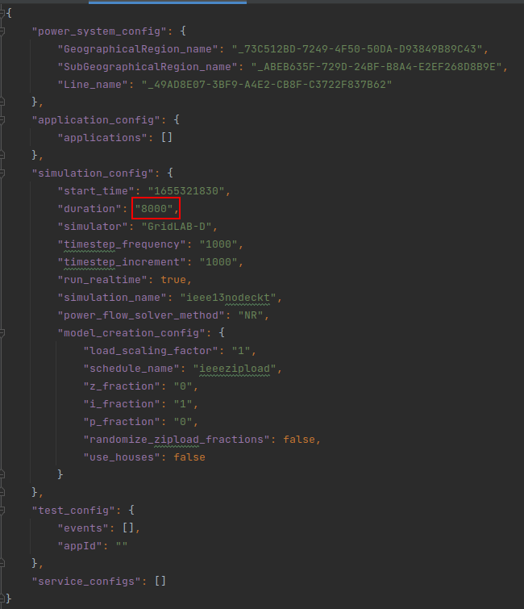
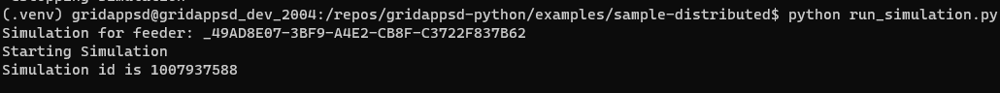
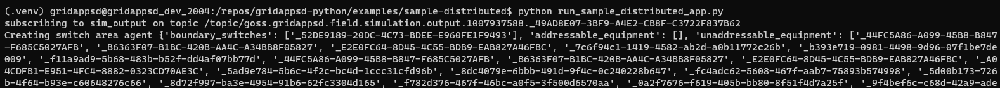

# Sample Distributed Field Bus Application

This repository contains examples of distributed applications and services developed using GridAPPS-D's distributed API.

1. [Sample Distributed App](https://github.com/GRIDAPPSD/gridappsd-sample-distributed-app/blob/after_test/run_sample_distributed_app.py):
   It is an example of a distributed application with a Coordinating Agent that spawns distributed agents at Feeder, Switch areas and
   Secondary areas in a grid network model. It also contains example for discovering near by agents and requesting data from them.

2. [Sample Distributed App Without Coordinating App](<https://github.com/GRIDAPPSD/gridappsd-sample-distributed-app/blob/after_test/run_sample_distributed_app_without_coord_agent.py>):
   It is an example of a distributed application that creates distributed agents at Feeder, Switch areas and Secondary areas in a grid network model.

3. [Sample Distributed Service](https://github.com/GRIDAPPSD/gridappsd-sample-distributed-app/blob/after_test/run_sample_distributed_service.py):
   It is an example of a distributed service that receives request from near by distributed agents and respond with sample data.

## Requirements 

- Python3.10
- Python3.10-venv if using virtual environments.

## Setup

Generally we use a new virtual environment for the sample applications.  

```bash
# Creates virtual environment
python3 -m venv myvenv

# Activates the virtual environment
source myvenv/bin/activate

# Install requirements
pip install -r requirements.txt
```

## Configuration

### 1. Configure Simulation Request

These examples can be configured to work with either simulated or real network and measurements. By default, they are configured to work with 13nodeckt
network model from gridappsd with 8000 seconds of real time simulation.  You can find the following file in
[sample-distributed/config_files_simulated/simulation-config.json](config_files_simulated/simulation-config.json) should you want to change it.



### 2. Provide Authentication Details

> [!IMPORTANT]
> The auth_context.py is configured to run from inside the gridapspd container.  If running outside please change `GRIDAPPSD_ADDRESS` to `localhost` or `machine name`.

Modify [auth_context.py](https://github.com/GRIDAPPSD/gridappsd-sample-distributed-app/blob/after_test/auth_context.py) with the correct values for the different environmental variables.  These will be used
to overwrite the values in the different yaml configuration files for connecting to gridappsd as field bus.

## Steps to Run

### 1. Start GridAPPS-D Platform

In order to run this example you will need to first have GridAPPS-D platform running.  Follow instructions at gridappsd-docker repository.

### 2. Start a Simulation

Open a new command terminals with an environment containing the gridappsd-python version.

```commandline
# Command line 1 holds the simulation running
python run_simulation.py
```



### 3. Run Sample Distributed Service

Open a new terminal and run the sample distributed service so sample app can request data from the service.

```commandline
# Command line 1 holds the simulation running
python run_sample_distributed_service.py
```

### 4. Run Sample Distributed App (with or without coordinating app)

Open a new terminal and run the sample distributed app either with or without coordinating agents.

```commandline
# Command line 1 holds the simulation running
python run_sample_distributed_app.py
```

OR

```commandline
# Command line 1 holds the simulation running
python run_sample_distributed_app_without_coord_agent.py
```



You can see the creation and retrieval of all the messages on the different terminals.
